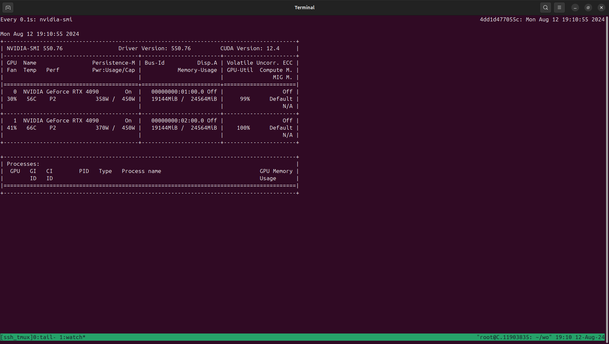

# Training GPT2 from scratch (and adding optimizations)

#### Ran first locally on self built system with 1x RTX3080 then on 2xRTX 4090 with DistributedDataParallel on cloud

#### Total 11 files 1 baseline.py + 10 speed-up.py (1-10) or optimizations done


1. Baseline : `for 50 epochs Batch=2 seq_len = 1024`

   ```
   loaded len : 338025
   1 epoch = :338025//2048 = 165 batches
   step : 1, loss: 10.992466926574707
   step : 1 | loss: 10.992466926574707 | dt: 457.29 ms | tokens/sec: 4.48
   step : 2, loss: 9.362780570983887
   step : 2 | loss: 9.362780570983887 | dt: 177.27 ms | tokens/sec: 11.55
   step : 3, loss: 8.913346290588379
   step : 3 | loss: 8.913346290588379 | dt: 176.75 ms | tokens/sec: 11.59
   step : 4, loss: 8.59444522857666
   step : 4 | loss: 8.59444522857666 | dt: 177.05 ms | tokens/sec: 11.57
   step : 5, loss: 8.424555778503418
   step : 5 | loss: 8.424555778503418 | dt: 176.82 ms | tokens/sec: 11.58
   step : 6, loss: 8.19937515258789
   step : 6 | loss: 8.19937515258789 | dt: 176.61 ms | tokens/sec: 11.60
   step : 7, loss: 7.923678874969482
   step : 7 | loss: 7.923678874969482 | dt: 176.72 ms | tokens/sec: 11.59
   step : 8, loss: 7.789344787597656
   step : 8 | loss: 7.789344787597656 | dt: 176.37 ms | tokens/sec: 11.61
   step : 9, loss: 7.419158935546875
   step : 9 | loss: 7.419158935546875 | dt: 176.84 ms | tokens/sec: 11.58
   step : 10, loss: 7.1246137619018555
   step : 10 | loss: 7.1246137619018555 | dt: 177.03 ms | tokens/sec: 11.57
   step : 11, loss: 6.908545970916748
   step : 11 | loss: 6.908545970916748 | dt: 177.35 ms | tokens/sec: 11.55
   step : 12, loss: 6.317990779876709
   step : 12 | loss: 6.317990779876709 | dt: 177.03 ms | tokens/sec: 11.57
   step : 13, loss: 6.572101593017578
   step : 13 | loss: 6.572101593017578 | dt: 177.14 ms | tokens/sec: 11.56
   step : 14, loss: 6.357314109802246
   step : 14 | loss: 6.357314109802246 | dt: 177.38 ms | tokens/sec: 11.55
   step : 15, loss: 6.365540981292725
   step : 15 | loss: 6.365540981292725 | dt: 176.96 ms | tokens/sec: 11.57
   step : 16, loss: 6.229216575622559
   step : 16 | loss: 6.229216575622559 | dt: 177.13 ms | tokens/sec: 11.56
   step : 17, loss: 6.569193363189697
   step : 17 | loss: 6.569193363189697 | dt: 177.78 ms | tokens/sec: 11.52
   step : 18, loss: 5.985564708709717
   step : 18 | loss: 5.985564708709717 | dt: 176.96 ms | tokens/sec: 11.57
   step : 19, loss: 5.989353179931641
   step : 19 | loss: 5.989353179931641 | dt: 176.91 ms | tokens/sec: 11.58
   step : 20, loss: 5.9395246505737305
   step : 20 | loss: 5.9395246505737305 | dt: 177.24 ms | tokens/sec: 11.56
   step : 21, loss: 6.274771213531494
   step : 21 | loss: 6.274771213531494 | dt: 177.08 ms | tokens/sec: 11.57
   step : 22, loss: 6.0939202308654785
   step : 22 | loss: 6.0939202308654785 | dt: 177.07 ms | tokens/sec: 11.57
   step : 23, loss: 6.108556270599365
   step : 23 | loss: 6.108556270599365 | dt: 177.27 ms | tokens/sec: 11.55
   step : 24, loss: 6.858168601989746
   step : 24 | loss: 6.858168601989746 | dt: 177.66 ms | tokens/sec: 11.53
   step : 25, loss: 6.918650150299072
   step : 25 | loss: 6.918650150299072 | dt: 177.67 ms | tokens/sec: 11.53
   step : 26, loss: 6.609850883483887
   step : 26 | loss: 6.609850883483887 | dt: 177.70 ms | tokens/sec: 11.53
   step : 27, loss: 6.726373195648193
   step : 27 | loss: 6.726373195648193 | dt: 177.41 ms | tokens/sec: 11.54
   step : 28, loss: 6.666073322296143
   step : 28 | loss: 6.666073322296143 | dt: 177.38 ms | tokens/sec: 11.55
   step : 29, loss: 6.5002665519714355
   step : 29 | loss: 6.5002665519714355 | dt: 177.70 ms | tokens/sec: 11.53
   step : 30, loss: 6.198619842529297
   step : 30 | loss: 6.198619842529297 | dt: 177.54 ms | tokens/sec: 11.54
   step : 31, loss: 6.365462303161621
   step : 31 | loss: 6.365462303161621 | dt: 177.29 ms | tokens/sec: 11.55
   step : 32, loss: 6.395125389099121
   step : 32 | loss: 6.395125389099121 | dt: 177.51 ms | tokens/sec: 11.54
   step : 33, loss: 6.252864360809326
   step : 33 | loss: 6.252864360809326 | dt: 178.11 ms | tokens/sec: 11.50
   step : 34, loss: 6.140191078186035
   step : 34 | loss: 6.140191078186035 | dt: 177.97 ms | tokens/sec: 11.51
   step : 35, loss: 6.079408168792725
   step : 35 | loss: 6.079408168792725 | dt: 177.78 ms | tokens/sec: 11.52
   step : 36, loss: 5.987005710601807
   step : 36 | loss: 5.987005710601807 | dt: 177.57 ms | tokens/sec: 11.53
   step : 37, loss: 6.23392915725708
   step : 37 | loss: 6.23392915725708 | dt: 177.40 ms | tokens/sec: 11.54
   step : 38, loss: 6.167716979980469
   step : 38 | loss: 6.167716979980469 | dt: 177.75 ms | tokens/sec: 11.52
   step : 39, loss: 6.066115856170654
   step : 39 | loss: 6.066115856170654 | dt: 177.59 ms | tokens/sec: 11.53
   step : 40, loss: 6.409902572631836
   step : 40 | loss: 6.409902572631836 | dt: 177.73 ms | tokens/sec: 11.52
   step : 41, loss: 6.496269702911377
   step : 41 | loss: 6.496269702911377 | dt: 177.67 ms | tokens/sec: 11.53
   step : 42, loss: 6.3880767822265625
   step : 42 | loss: 6.3880767822265625 | dt: 178.28 ms | tokens/sec: 11.49
   step : 43, loss: 6.2094244956970215
   step : 43 | loss: 6.2094244956970215 | dt: 177.78 ms | tokens/sec: 11.52
   step : 44, loss: 6.117251396179199
   step : 44 | loss: 6.117251396179199 | dt: 177.82 ms | tokens/sec: 11.52
   step : 45, loss: 6.3896870613098145
   step : 45 | loss: 6.3896870613098145 | dt: 177.64 ms | tokens/sec: 11.53
   step : 46, loss: 6.23189640045166
   step : 46 | loss: 6.23189640045166 | dt: 177.88 ms | tokens/sec: 11.51
   step : 47, loss: 6.300188064575195
   step : 47 | loss: 6.300188064575195 | dt: 177.85 ms | tokens/sec: 11.52
   step : 48, loss: 6.530782699584961
   step : 48 | loss: 6.530782699584961 | dt: 177.97 ms | tokens/sec: 11.51
   step : 49, loss: 6.381324768066406
   step : 49 | loss: 6.381324768066406 | dt: 177.64 ms | tokens/sec: 11.53
   step : 50, loss: 6.504200458526611
   step : 50 | loss: 6.504200458526611 | dt: 177.86 ms | tokens/sec: 11.51
   ```

   

2. Speed-up-1 : 

   ```python
   weight sharing
   self.transformer.wte.weights = self.lm_head.weight
   ```

   ```
   loaded len : 338025
   1 epoch = :338025//2048 = 165 batches 
   step : 1 | loss: 11.034530639648438 | dt: 441.33 ms | tokens/sec: 4.64
   step : 2 | loss: 9.378324508666992 | dt: 13.98 ms | tokens/sec: 146.55
   step : 3 | loss: 9.042380332946777 | dt: 13.45 ms | tokens/sec: 152.24
   step : 4 | loss: 8.829848289489746 | dt: 13.66 ms | tokens/sec: 149.93
   step : 5 | loss: 8.593969345092773 | dt: 13.82 ms | tokens/sec: 148.20
   step : 6 | loss: 8.252659797668457 | dt: 16.61 ms | tokens/sec: 123.32
   step : 7 | loss: 7.960568904876709 | dt: 16.56 ms | tokens/sec: 123.70
   step : 8 | loss: 7.893648624420166 | dt: 16.49 ms | tokens/sec: 124.18
   step : 9 | loss: 7.539044380187988 | dt: 15.23 ms | tokens/sec: 134.45
   step : 10 | loss: 7.256902694702148 | dt: 15.12 ms | tokens/sec: 135.46
   step : 11 | loss: 7.048425197601318 | dt: 16.81 ms | tokens/sec: 121.81
   step : 12 | loss: 6.543119430541992 | dt: 16.42 ms | tokens/sec: 124.72
   step : 13 | loss: 6.7233710289001465 | dt: 16.46 ms | tokens/sec: 124.44
   step : 14 | loss: 6.452727794647217 | dt: 15.79 ms | tokens/sec: 129.68
   step : 15 | loss: 6.464654445648193 | dt: 15.48 ms | tokens/sec: 132.34
   step : 16 | loss: 6.35504150390625 | dt: 16.77 ms | tokens/sec: 122.13
   step : 17 | loss: 6.594368934631348 | dt: 16.75 ms | tokens/sec: 122.26
   step : 18 | loss: 6.050628185272217 | dt: 16.74 ms | tokens/sec: 122.35
   step : 19 | loss: 6.032513618469238 | dt: 15.51 ms | tokens/sec: 132.08
   step : 20 | loss: 6.012285232543945 | dt: 17.61 ms | tokens/sec: 116.29
   step : 21 | loss: 6.338414192199707 | dt: 17.03 ms | tokens/sec: 120.27
   step : 22 | loss: 6.161732196807861 | dt: 16.83 ms | tokens/sec: 121.70
   step : 23 | loss: 6.154943943023682 | dt: 16.81 ms | tokens/sec: 121.85
   step : 24 | loss: 6.832274436950684 | dt: 13.94 ms | tokens/sec: 146.91
   step : 25 | loss: 6.904111862182617 | dt: 13.41 ms | tokens/sec: 152.71
   step : 26 | loss: 6.597776412963867 | dt: 13.20 ms | tokens/sec: 155.17
   step : 27 | loss: 6.762705326080322 | dt: 13.18 ms | tokens/sec: 155.44
   step : 28 | loss: 6.688722610473633 | dt: 13.21 ms | tokens/sec: 154.99
   step : 29 | loss: 6.514245510101318 | dt: 13.89 ms | tokens/sec: 147.42
   step : 30 | loss: 6.226738929748535 | dt: 13.67 ms | tokens/sec: 149.79
   step : 31 | loss: 6.378033638000488 | dt: 13.50 ms | tokens/sec: 151.72
   step : 32 | loss: 6.42918062210083 | dt: 13.31 ms | tokens/sec: 153.87
   step : 33 | loss: 6.312799453735352 | dt: 13.69 ms | tokens/sec: 149.56
   step : 34 | loss: 6.1439619064331055 | dt: 14.78 ms | tokens/sec: 138.59
   step : 35 | loss: 6.093750476837158 | dt: 13.76 ms | tokens/sec: 148.86
   step : 36 | loss: 6.004867076873779 | dt: 13.75 ms | tokens/sec: 148.93
   step : 37 | loss: 6.253818988800049 | dt: 13.80 ms | tokens/sec: 148.37
   step : 38 | loss: 6.201337814331055 | dt: 14.41 ms | tokens/sec: 142.09
   step : 39 | loss: 6.137325763702393 | dt: 14.39 ms | tokens/sec: 142.36
   step : 40 | loss: 6.365387439727783 | dt: 13.74 ms | tokens/sec: 149.03
   step : 41 | loss: 6.535684585571289 | dt: 13.70 ms | tokens/sec: 149.54
   step : 42 | loss: 6.430989742279053 | dt: 13.77 ms | tokens/sec: 148.69
   step : 43 | loss: 6.289614200592041 | dt: 14.65 ms | tokens/sec: 139.79
   step : 44 | loss: 6.172123432159424 | dt: 13.88 ms | tokens/sec: 147.54
   step : 45 | loss: 6.395931720733643 | dt: 13.71 ms | tokens/sec: 149.43
   step : 46 | loss: 6.246120452880859 | dt: 13.69 ms | tokens/sec: 149.61
   step : 47 | loss: 6.333895206451416 | dt: 13.07 ms | tokens/sec: 156.74
   step : 48 | loss: 6.549344062805176 | dt: 14.76 ms | tokens/sec: 138.71
   step : 49 | loss: 6.410884857177734 | dt: 14.19 ms | tokens/sec: 144.28
   step : 50 | loss: 6.527963638305664 | dt: 13.59 ms | tokens/sec: 150.67
   ```

   

3. Speed-up-2: `torch.set_float32_matmul_precision('high')` this trades-off precision for speed (default is 'highest')

   Supports three settings:

   > - “highest”, float32 matrix multiplications use the float32 datatype (24 mantissa bits with 23 bits explicitly stored) for internal computations.
   > - “high”, float32 matrix multiplications either use the TensorFloat32 datatype (10 mantissa bits explicitly stored) or treat each float32 number as the sum of two bfloat16 numbers (approximately 16 mantissa bits with 14 bits explicitly stored), if the appropriate fast matrix multiplication algorithms are available. Otherwise float32 matrix multiplications are computed as if the precision is “highest”. See below for more information on the bfloat16 approach.
   > - “medium”, float32 matrix multiplications use the bfloat16 datatype (8 mantissa bits with 7 bits explicitly stored) for internal computations, if a fast matrix multiplication algorithm using that datatype internally is available. Otherwise float32 matrix multiplications are computed as if the precision is “high”.

   ```
   loaded len : 338025
   1 epoch = :338025//2048 = 165 batches 
   step : 1 | loss: 10.972225189208984 | dt: 429.43 ms | tokens/sec: 4.77
   step : 2 | loss: 9.371011734008789 | dt: 13.81 ms | tokens/sec: 148.31
   step : 3 | loss: 8.929434776306152 | dt: 13.21 ms | tokens/sec: 155.04
   step : 4 | loss: 8.74753189086914 | dt: 13.34 ms | tokens/sec: 153.54
   step : 5 | loss: 8.45324420928955 | dt: 13.39 ms | tokens/sec: 152.95
   step : 6 | loss: 8.298818588256836 | dt: 16.37 ms | tokens/sec: 125.09
   step : 7 | loss: 7.967606544494629 | dt: 16.36 ms | tokens/sec: 125.21
   step : 8 | loss: 7.814459800720215 | dt: 16.40 ms | tokens/sec: 124.86
   step : 9 | loss: 7.514547824859619 | dt: 16.77 ms | tokens/sec: 122.11
   step : 10 | loss: 7.265167236328125 | dt: 16.52 ms | tokens/sec: 124.01
   step : 11 | loss: 6.964244842529297 | dt: 16.74 ms | tokens/sec: 122.37
   step : 12 | loss: 6.415964603424072 | dt: 16.89 ms | tokens/sec: 121.25
   step : 13 | loss: 6.641633987426758 | dt: 16.63 ms | tokens/sec: 123.17
   step : 14 | loss: 6.407373905181885 | dt: 16.98 ms | tokens/sec: 120.64
   step : 15 | loss: 6.440959453582764 | dt: 16.71 ms | tokens/sec: 122.56
   step : 16 | loss: 6.266635894775391 | dt: 16.95 ms | tokens/sec: 120.85
   step : 17 | loss: 6.560628890991211 | dt: 16.90 ms | tokens/sec: 121.19
   step : 18 | loss: 6.018641471862793 | dt: 16.82 ms | tokens/sec: 121.74
   step : 19 | loss: 6.018270969390869 | dt: 16.95 ms | tokens/sec: 120.80
   step : 20 | loss: 6.000973224639893 | dt: 16.98 ms | tokens/sec: 120.60
   step : 21 | loss: 6.321657657623291 | dt: 16.72 ms | tokens/sec: 122.50
   step : 22 | loss: 6.1373491287231445 | dt: 16.97 ms | tokens/sec: 120.67
   step : 23 | loss: 6.1461310386657715 | dt: 16.97 ms | tokens/sec: 120.72
   step : 24 | loss: 6.867385387420654 | dt: 16.97 ms | tokens/sec: 120.68
   step : 25 | loss: 6.902945518493652 | dt: 16.77 ms | tokens/sec: 122.15
   step : 26 | loss: 6.638487339019775 | dt: 20.03 ms | tokens/sec: 102.22
   step : 27 | loss: 6.710422992706299 | dt: 16.94 ms | tokens/sec: 120.88
   step : 28 | loss: 6.6475934982299805 | dt: 17.09 ms | tokens/sec: 119.82
   step : 29 | loss: 6.508031845092773 | dt: 17.05 ms | tokens/sec: 120.12
   step : 30 | loss: 6.206567287445068 | dt: 16.99 ms | tokens/sec: 120.52
   step : 31 | loss: 6.306589603424072 | dt: 16.80 ms | tokens/sec: 121.92
   step : 32 | loss: 6.361763954162598 | dt: 16.93 ms | tokens/sec: 120.97
   step : 33 | loss: 6.252153396606445 | dt: 16.95 ms | tokens/sec: 120.82
   step : 34 | loss: 6.082510948181152 | dt: 16.85 ms | tokens/sec: 121.52
   step : 35 | loss: 6.025113582611084 | dt: 16.96 ms | tokens/sec: 120.78
   step : 36 | loss: 5.933845043182373 | dt: 16.81 ms | tokens/sec: 121.84
   step : 37 | loss: 6.183091163635254 | dt: 16.99 ms | tokens/sec: 120.56
   step : 38 | loss: 6.127077102661133 | dt: 16.91 ms | tokens/sec: 121.10
   step : 39 | loss: 6.035717487335205 | dt: 17.02 ms | tokens/sec: 120.34
   step : 40 | loss: 6.3222479820251465 | dt: 17.07 ms | tokens/sec: 119.98
   step : 41 | loss: 6.501198768615723 | dt: 16.80 ms | tokens/sec: 121.92
   step : 42 | loss: 6.3658037185668945 | dt: 16.81 ms | tokens/sec: 121.80
   step : 43 | loss: 6.190441608428955 | dt: 14.45 ms | tokens/sec: 141.73
   step : 44 | loss: 6.091060638427734 | dt: 14.63 ms | tokens/sec: 139.99
   step : 45 | loss: 6.35038948059082 | dt: 16.27 ms | tokens/sec: 125.89
   step : 46 | loss: 6.186710834503174 | dt: 16.60 ms | tokens/sec: 123.38
   step : 47 | loss: 6.269695281982422 | dt: 16.51 ms | tokens/sec: 124.08
   step : 48 | loss: 6.495201587677002 | dt: 16.71 ms | tokens/sec: 122.53
   step : 49 | loss: 6.383784294128418 | dt: 16.81 ms | tokens/sec: 121.85
   step : 50 | loss: 6.43054723739624 | dt: 16.87 ms | tokens/sec: 121.40
   ```

   

4. Speed-up-3: 

   ```python
    with torch.autocast(device_type='cuda', dtype=torch.bfloat16):
                logits, loss = model(x, y)
   ```

   - Instances of [torch.autocast](https://pytorch.org/docs/stable/amp.html#autocasting) serve as context managers that allow regions of your script to run in mixed precision.
   - In these regions, CUDA ops run in a dtype chosen by autocast to improve performance while maintaining accuracy. See the [Autocast Op Reference](https://pytorch.org/docs/stable/amp.html#autocast-op-reference) for details on what precision autocast chooses for each op, and under what circumstances.

   #### Batch size changed to 3 without OOM error

   ```
   loaded len : 338025
   1 epoch = :338025//3072 = 110 batches 
   step : 1 | loss: 10.972432136535645 | dt: 477.67 ms | tokens/sec: 6.43
   step : 2 | loss: 9.31514835357666 | dt: 17.14 ms | tokens/sec: 179.27
   step : 3 | loss: 8.972076416015625 | dt: 16.36 ms | tokens/sec: 187.82
   step : 4 | loss: 8.59674072265625 | dt: 16.85 ms | tokens/sec: 182.29
   step : 5 | loss: 8.307440757751465 | dt: 16.95 ms | tokens/sec: 181.19
   step : 6 | loss: 8.081329345703125 | dt: 18.49 ms | tokens/sec: 166.18
   step : 7 | loss: 7.66778564453125 | dt: 18.79 ms | tokens/sec: 163.46
   step : 8 | loss: 7.3395094871521 | dt: 18.77 ms | tokens/sec: 163.64
   step : 9 | loss: 7.3281426429748535 | dt: 20.77 ms | tokens/sec: 147.91
   step : 10 | loss: 7.029322147369385 | dt: 20.94 ms | tokens/sec: 146.73
   step : 11 | loss: 7.012356281280518 | dt: 21.08 ms | tokens/sec: 145.72
   step : 12 | loss: 6.78605842590332 | dt: 20.84 ms | tokens/sec: 147.38
   step : 13 | loss: 6.482253551483154 | dt: 20.86 ms | tokens/sec: 147.27
   step : 14 | loss: 6.758306980133057 | dt: 20.93 ms | tokens/sec: 146.77
   step : 15 | loss: 6.5493693351745605 | dt: 20.81 ms | tokens/sec: 147.60
   step : 16 | loss: 6.798040390014648 | dt: 20.90 ms | tokens/sec: 146.97
   step : 17 | loss: 7.006654262542725 | dt: 20.82 ms | tokens/sec: 147.54
   step : 18 | loss: 6.864293575286865 | dt: 20.99 ms | tokens/sec: 146.35
   step : 19 | loss: 6.714807033538818 | dt: 21.01 ms | tokens/sec: 146.19
   step : 20 | loss: 6.494933605194092 | dt: 21.08 ms | tokens/sec: 145.74
   step : 21 | loss: 6.458507061004639 | dt: 19.41 ms | tokens/sec: 158.23
   step : 22 | loss: 6.460880279541016 | dt: 19.54 ms | tokens/sec: 157.24
   step : 23 | loss: 6.26420783996582 | dt: 18.74 ms | tokens/sec: 163.97
   step : 24 | loss: 6.134950637817383 | dt: 18.37 ms | tokens/sec: 167.23
   step : 25 | loss: 6.352321147918701 | dt: 19.36 ms | tokens/sec: 158.70
   step : 26 | loss: 6.3004679679870605 | dt: 20.78 ms | tokens/sec: 147.81
   step : 27 | loss: 6.583639144897461 | dt: 20.97 ms | tokens/sec: 146.51
   step : 28 | loss: 6.553768157958984 | dt: 19.54 ms | tokens/sec: 157.18
   step : 29 | loss: 6.46771240234375 | dt: 20.65 ms | tokens/sec: 148.75
   step : 30 | loss: 6.419882297515869 | dt: 20.64 ms | tokens/sec: 148.87
   step : 31 | loss: 6.375476837158203 | dt: 20.52 ms | tokens/sec: 149.69
   step : 32 | loss: 6.5716705322265625 | dt: 20.50 ms | tokens/sec: 149.83
   step : 33 | loss: 6.573505401611328 | dt: 20.66 ms | tokens/sec: 148.73
   step : 34 | loss: 6.515076160430908 | dt: 20.88 ms | tokens/sec: 147.10
   step : 35 | loss: 6.46593713760376 | dt: 20.76 ms | tokens/sec: 147.98
   step : 36 | loss: 6.334239482879639 | dt: 20.79 ms | tokens/sec: 147.75
   step : 37 | loss: 6.347877502441406 | dt: 20.78 ms | tokens/sec: 147.81
   step : 38 | loss: 6.515169620513916 | dt: 19.01 ms | tokens/sec: 161.63
   step : 39 | loss: 6.262509822845459 | dt: 18.89 ms | tokens/sec: 162.61
   step : 40 | loss: 6.223466396331787 | dt: 18.90 ms | tokens/sec: 162.56
   step : 41 | loss: 6.083242893218994 | dt: 18.73 ms | tokens/sec: 163.98
   step : 42 | loss: 5.962005615234375 | dt: 19.35 ms | tokens/sec: 158.75
   step : 43 | loss: 6.101660251617432 | dt: 20.06 ms | tokens/sec: 153.12
   step : 44 | loss: 6.254205226898193 | dt: 21.50 ms | tokens/sec: 142.87
   step : 45 | loss: 6.370960712432861 | dt: 20.91 ms | tokens/sec: 146.94
   step : 46 | loss: 6.4265289306640625 | dt: 20.87 ms | tokens/sec: 147.19
   step : 47 | loss: 6.128718852996826 | dt: 20.80 ms | tokens/sec: 147.67
   step : 48 | loss: 6.397125244140625 | dt: 20.30 ms | tokens/sec: 151.34
   step : 49 | loss: 6.048943996429443 | dt: 20.77 ms | tokens/sec: 147.87
   step : 50 | loss: 6.194081783294678 | dt: 20.78 ms | tokens/sec: 147.87
   ```

   

5. Speed-up-4: `# Solving for residual std scaling issue` 

   ```python
   x = torch.zeros(768)
   
   n = 100
   
   for i in range(n):
       x = x + torch.randn(768)
   
   print(x.std()) # tensor(9.8123)
   ```

   ```python
   x = torch.zeros(768)
   
   n = 100
   
   for i in range(n):
       x = x + n**-0.5 *  torch.randn(768)
   
   print(x.std()) # tensor(1.0066)
   ```

   ```
   loaded len : 338025
   1 epoch = :338025//3072 = 110 batches 
   step : 1 | loss: 11.02117919921875 | dt: 481.23 ms | tokens/sec: 6.38
   step : 2 | loss: 9.636322021484375 | dt: 17.07 ms | tokens/sec: 180.01
   step : 3 | loss: 9.440150260925293 | dt: 16.69 ms | tokens/sec: 184.06
   step : 4 | loss: 8.962005615234375 | dt: 16.72 ms | tokens/sec: 183.78
   step : 5 | loss: 8.809062004089355 | dt: 16.86 ms | tokens/sec: 182.20
   step : 6 | loss: 8.539729118347168 | dt: 20.57 ms | tokens/sec: 149.33
   step : 7 | loss: 8.14616870880127 | dt: 20.41 ms | tokens/sec: 150.53
   step : 8 | loss: 7.8643798828125 | dt: 21.41 ms | tokens/sec: 143.50
   step : 9 | loss: 7.695607662200928 | dt: 16.49 ms | tokens/sec: 186.25
   step : 10 | loss: 7.4839324951171875 | dt: 20.06 ms | tokens/sec: 153.16
   step : 11 | loss: 7.3768181800842285 | dt: 19.53 ms | tokens/sec: 157.31
   step : 12 | loss: 7.2171759605407715 | dt: 19.72 ms | tokens/sec: 155.78
   step : 13 | loss: 6.976043701171875 | dt: 18.79 ms | tokens/sec: 163.53
   step : 14 | loss: 7.1086883544921875 | dt: 18.78 ms | tokens/sec: 163.54
   step : 15 | loss: 6.907534122467041 | dt: 19.69 ms | tokens/sec: 156.06
   step : 16 | loss: 7.143796443939209 | dt: 21.26 ms | tokens/sec: 144.51
   step : 17 | loss: 7.2806854248046875 | dt: 21.10 ms | tokens/sec: 145.57
   step : 18 | loss: 7.152984619140625 | dt: 21.12 ms | tokens/sec: 145.45
   step : 19 | loss: 7.09655237197876 | dt: 21.01 ms | tokens/sec: 146.19
   step : 20 | loss: 6.83319091796875 | dt: 20.77 ms | tokens/sec: 147.92
   step : 21 | loss: 6.84472131729126 | dt: 21.04 ms | tokens/sec: 146.00
   step : 22 | loss: 6.82476282119751 | dt: 21.18 ms | tokens/sec: 145.03
   step : 23 | loss: 6.6950836181640625 | dt: 21.20 ms | tokens/sec: 144.93
   step : 24 | loss: 6.5393218994140625 | dt: 20.75 ms | tokens/sec: 148.05
   step : 25 | loss: 6.749298095703125 | dt: 18.67 ms | tokens/sec: 164.57
   step : 26 | loss: 6.729494571685791 | dt: 21.08 ms | tokens/sec: 145.72
   step : 27 | loss: 7.013936519622803 | dt: 20.92 ms | tokens/sec: 146.86
   step : 28 | loss: 7.011690616607666 | dt: 19.48 ms | tokens/sec: 157.69
   step : 29 | loss: 6.980679988861084 | dt: 19.25 ms | tokens/sec: 159.59
   step : 30 | loss: 6.836517333984375 | dt: 19.12 ms | tokens/sec: 160.70
   step : 31 | loss: 6.791249752044678 | dt: 18.28 ms | tokens/sec: 168.03
   step : 32 | loss: 6.8990020751953125 | dt: 19.00 ms | tokens/sec: 161.67
   step : 33 | loss: 6.8716559410095215 | dt: 20.04 ms | tokens/sec: 153.31
   step : 34 | loss: 6.9678778648376465 | dt: 21.09 ms | tokens/sec: 145.63
   step : 35 | loss: 6.815711975097656 | dt: 21.01 ms | tokens/sec: 146.25
   step : 36 | loss: 6.626636505126953 | dt: 21.17 ms | tokens/sec: 145.13
   step : 37 | loss: 6.640745639801025 | dt: 20.83 ms | tokens/sec: 147.49
   step : 38 | loss: 6.829935550689697 | dt: 21.00 ms | tokens/sec: 146.25
   step : 39 | loss: 6.609035491943359 | dt: 20.74 ms | tokens/sec: 148.12
   step : 40 | loss: 6.539403438568115 | dt: 20.63 ms | tokens/sec: 148.94
   step : 41 | loss: 6.468142032623291 | dt: 21.27 ms | tokens/sec: 144.42
   step : 42 | loss: 6.3780999183654785 | dt: 20.97 ms | tokens/sec: 146.48
   step : 43 | loss: 6.497533321380615 | dt: 20.87 ms | tokens/sec: 147.21
   step : 44 | loss: 6.5176682472229 | dt: 20.78 ms | tokens/sec: 147.86
   step : 45 | loss: 6.642275333404541 | dt: 21.06 ms | tokens/sec: 145.86
   step : 46 | loss: 6.703830718994141 | dt: 19.47 ms | tokens/sec: 157.80
   step : 47 | loss: 6.455974578857422 | dt: 19.46 ms | tokens/sec: 157.83
   step : 48 | loss: 6.670574188232422 | dt: 19.09 ms | tokens/sec: 160.96
   step : 49 | loss: 6.389180660247803 | dt: 18.39 ms | tokens/sec: 167.05
   step : 50 | loss: 6.540647983551025 | dt: 18.59 ms | tokens/sec: 165.29
   ```

   

6. Speed-up-5: `torch.compile` 

   1. `default` mode (train_loader = DataLoaderLite(B=3, T=1024))

   ```
   loaded len : 338025
   1 epoch = :338025//3072 = 110 batches 
   step : 1 | loss: 10.9637451171875 | dt: 22360.53 ms | tokens/sec: 0.14
   step : 2 | loss: 9.480566024780273 | dt: 12.74 ms | tokens/sec: 241.05
   step : 3 | loss: 9.428997039794922 | dt: 11.62 ms | tokens/sec: 264.40
   step : 4 | loss: 8.891825675964355 | dt: 12.49 ms | tokens/sec: 246.03
   step : 5 | loss: 8.725260734558105 | dt: 12.45 ms | tokens/sec: 246.79
   step : 6 | loss: 8.502706527709961 | dt: 15.21 ms | tokens/sec: 201.94
   step : 7 | loss: 8.146810531616211 | dt: 12.56 ms | tokens/sec: 244.68
   step : 8 | loss: 7.88178014755249 | dt: 15.22 ms | tokens/sec: 201.89
   step : 9 | loss: 7.67468786239624 | dt: 15.28 ms | tokens/sec: 201.01
   step : 10 | loss: 7.452474117279053 | dt: 14.67 ms | tokens/sec: 209.43
   step : 11 | loss: 7.310636043548584 | dt: 12.64 ms | tokens/sec: 243.00
   step : 12 | loss: 7.158363342285156 | dt: 12.53 ms | tokens/sec: 245.17
   step : 13 | loss: 6.9413862228393555 | dt: 15.16 ms | tokens/sec: 202.59
   step : 14 | loss: 7.101417541503906 | dt: 13.28 ms | tokens/sec: 231.32
   step : 15 | loss: 6.925682067871094 | dt: 13.88 ms | tokens/sec: 221.30
   step : 16 | loss: 7.119115352630615 | dt: 15.63 ms | tokens/sec: 196.55
   step : 17 | loss: 7.2742109298706055 | dt: 15.41 ms | tokens/sec: 199.35
   step : 18 | loss: 7.1411237716674805 | dt: 13.96 ms | tokens/sec: 220.04
   step : 19 | loss: 7.114797115325928 | dt: 14.18 ms | tokens/sec: 216.70
   step : 20 | loss: 6.8474531173706055 | dt: 15.17 ms | tokens/sec: 202.51
   step : 21 | loss: 6.848175048828125 | dt: 15.78 ms | tokens/sec: 194.71
   step : 22 | loss: 6.874486446380615 | dt: 13.60 ms | tokens/sec: 225.95
   step : 23 | loss: 6.7365217208862305 | dt: 14.29 ms | tokens/sec: 214.91
   step : 24 | loss: 6.571014404296875 | dt: 15.19 ms | tokens/sec: 202.29
   step : 25 | loss: 6.777979850769043 | dt: 15.15 ms | tokens/sec: 202.76
   step : 26 | loss: 6.740437984466553 | dt: 12.90 ms | tokens/sec: 238.15
   step : 27 | loss: 7.059422969818115 | dt: 14.15 ms | tokens/sec: 217.08
   step : 28 | loss: 7.059262752532959 | dt: 15.26 ms | tokens/sec: 201.26
   step : 29 | loss: 7.061521053314209 | dt: 15.34 ms | tokens/sec: 200.26
   step : 30 | loss: 6.8702545166015625 | dt: 12.57 ms | tokens/sec: 244.48
   step : 31 | loss: 6.852839469909668 | dt: 14.36 ms | tokens/sec: 213.93
   step : 32 | loss: 6.9842634201049805 | dt: 15.06 ms | tokens/sec: 203.94
   step : 33 | loss: 6.980400085449219 | dt: 15.55 ms | tokens/sec: 197.51
   step : 34 | loss: 6.937014579772949 | dt: 13.11 ms | tokens/sec: 234.31
   step : 35 | loss: 6.91455602645874 | dt: 14.70 ms | tokens/sec: 209.04
   step : 36 | loss: 6.703514099121094 | dt: 15.32 ms | tokens/sec: 200.49
   step : 37 | loss: 6.730380058288574 | dt: 15.87 ms | tokens/sec: 193.58
   step : 38 | loss: 6.899803161621094 | dt: 13.12 ms | tokens/sec: 234.14
   step : 39 | loss: 6.6598029136657715 | dt: 14.80 ms | tokens/sec: 207.58
   step : 40 | loss: 6.588137626647949 | dt: 15.27 ms | tokens/sec: 201.14
   step : 41 | loss: 6.5279035568237305 | dt: 14.77 ms | tokens/sec: 208.02
   step : 42 | loss: 6.42883825302124 | dt: 12.64 ms | tokens/sec: 243.13
   step : 43 | loss: 6.508134365081787 | dt: 14.95 ms | tokens/sec: 205.44
   step : 44 | loss: 6.510167598724365 | dt: 15.27 ms | tokens/sec: 201.20
   step : 45 | loss: 6.68189001083374 | dt: 14.56 ms | tokens/sec: 211.00
   step : 46 | loss: 6.722249507904053 | dt: 13.35 ms | tokens/sec: 230.17
   step : 47 | loss: 6.468461513519287 | dt: 15.04 ms | tokens/sec: 204.27
   step : 48 | loss: 6.674006462097168 | dt: 14.78 ms | tokens/sec: 207.91
   step : 49 | loss: 6.398689270019531 | dt: 12.62 ms | tokens/sec: 243.49
   step : 50 | loss: 6.554343223571777 | dt: 13.90 ms | tokens/sec: 221.03
   ```

   2. 'max-autotune' 

      ```python
      train_loader = DataLoaderLite(B=3, T=1024)
      model.to(device)
      model = torch.compile(model,mode='max-autotune')
      ```

      

      ```
      loaded len : 338025
      1 epoch = :338025//3072 = 110 batches 
      W0818 17:17:31.970000 135448760849920 torch/_inductor/utils.py:945] [0/0] not enough SMs to use max_autotune_gemm mode
      step : 1 | loss: 11.026164054870605 | dt: 17527.72 ms | tokens/sec: 0.18
      step : 2 | loss: 9.569875717163086 | dt: 455.32 ms | tokens/sec: 6.75
      step : 3 | loss: 9.357203483581543 | dt: 5.90 ms | tokens/sec: 520.77
      step : 4 | loss: 8.899104118347168 | dt: 3.14 ms | tokens/sec: 977.39
      step : 5 | loss: 8.712087631225586 | dt: 4.23 ms | tokens/sec: 726.28
      step : 6 | loss: 8.477935791015625 | dt: 4.48 ms | tokens/sec: 685.15
      step : 7 | loss: 8.113673210144043 | dt: 4.63 ms | tokens/sec: 663.62
      step : 8 | loss: 7.787892818450928 | dt: 3.83 ms | tokens/sec: 801.30
      step : 9 | loss: 7.689666748046875 | dt: 4.49 ms | tokens/sec: 684.60
      step : 10 | loss: 7.445699214935303 | dt: 4.85 ms | tokens/sec: 633.04
      step : 11 | loss: 7.374290466308594 | dt: 3.96 ms | tokens/sec: 775.73
      step : 12 | loss: 7.193410396575928 | dt: 3.68 ms | tokens/sec: 835.38
      step : 13 | loss: 6.973905086517334 | dt: 4.47 ms | tokens/sec: 687.49
      step : 14 | loss: 7.131324768066406 | dt: 4.53 ms | tokens/sec: 678.65
      step : 15 | loss: 6.914395809173584 | dt: 3.49 ms | tokens/sec: 881.32
      step : 16 | loss: 7.1658477783203125 | dt: 4.27 ms | tokens/sec: 718.98
      step : 17 | loss: 7.332972526550293 | dt: 4.52 ms | tokens/sec: 679.91
      step : 18 | loss: 7.2183837890625 | dt: 3.95 ms | tokens/sec: 777.46
      step : 19 | loss: 7.159520626068115 | dt: 3.29 ms | tokens/sec: 933.89
      step : 20 | loss: 6.86719274520874 | dt: 4.33 ms | tokens/sec: 710.11
      step : 21 | loss: 6.870326042175293 | dt: 4.42 ms | tokens/sec: 695.58
      step : 22 | loss: 6.8467206954956055 | dt: 4.64 ms | tokens/sec: 662.63
      step : 23 | loss: 6.753901481628418 | dt: 3.57 ms | tokens/sec: 859.34
      step : 24 | loss: 6.587560176849365 | dt: 4.50 ms | tokens/sec: 682.43
      step : 25 | loss: 6.7819671630859375 | dt: 4.49 ms | tokens/sec: 684.68
      step : 26 | loss: 6.74200963973999 | dt: 4.72 ms | tokens/sec: 650.49
      step : 27 | loss: 7.021520137786865 | dt: 3.46 ms | tokens/sec: 887.57
      step : 28 | loss: 7.020266532897949 | dt: 4.45 ms | tokens/sec: 689.92
      step : 29 | loss: 6.968925476074219 | dt: 4.50 ms | tokens/sec: 682.25
      step : 30 | loss: 6.850001335144043 | dt: 4.92 ms | tokens/sec: 623.88
      step : 31 | loss: 6.838885307312012 | dt: 3.48 ms | tokens/sec: 883.92
      step : 32 | loss: 6.94580602645874 | dt: 4.50 ms | tokens/sec: 683.15
      step : 33 | loss: 6.932063102722168 | dt: 4.57 ms | tokens/sec: 672.35
      step : 34 | loss: 6.893486022949219 | dt: 4.45 ms | tokens/sec: 689.99
      step : 35 | loss: 6.8314642906188965 | dt: 3.40 ms | tokens/sec: 902.62
      step : 36 | loss: 6.691110134124756 | dt: 4.51 ms | tokens/sec: 680.98
      step : 37 | loss: 6.655230522155762 | dt: 4.34 ms | tokens/sec: 708.23
      step : 38 | loss: 6.835047721862793 | dt: 4.21 ms | tokens/sec: 729.69
      step : 39 | loss: 6.61981201171875 | dt: 3.80 ms | tokens/sec: 808.79
      step : 40 | loss: 6.5476202964782715 | dt: 4.30 ms | tokens/sec: 714.52
      step : 41 | loss: 6.487917900085449 | dt: 4.56 ms | tokens/sec: 674.11
      step : 42 | loss: 6.38550329208374 | dt: 3.64 ms | tokens/sec: 844.36
      step : 43 | loss: 6.508025169372559 | dt: 4.13 ms | tokens/sec: 743.80
      step : 44 | loss: 6.508434295654297 | dt: 4.51 ms | tokens/sec: 681.49
      step : 45 | loss: 6.655190944671631 | dt: 3.59 ms | tokens/sec: 856.25
      step : 46 | loss: 6.718452453613281 | dt: 3.32 ms | tokens/sec: 925.51
      step : 47 | loss: 6.472048759460449 | dt: 3.17 ms | tokens/sec: 968.21
      step : 48 | loss: 6.680724143981934 | dt: 3.27 ms | tokens/sec: 938.59
      step : 49 | loss: 6.397361755371094 | dt: 3.57 ms | tokens/sec: 860.71
      step : 50 | loss: 6.5433502197265625 | dt: 3.20 ms | tokens/sec: 959.41
      ```

      

7. Speed-up-6: `Pytorch Flash attention`

   

   ```python
   F.scaled_dot_product_attention(q, k, v, is_causal=True) 
   
   train_loader = DataLoaderLite(B=6, T=1024)
   ```

   ```
   loaded len : 338025
   1 epoch = :338025//6144 = 55 batches 
   W0818 17:18:19.299000 134293310801408 torch/_inductor/utils.py:945] [0/0] not enough SMs to use max_autotune_gemm mode
   step : 1 | loss: 10.97022533416748 | dt: 14823.05 ms | tokens/sec: 0.41
   step : 2 | loss: 9.507745742797852 | dt: 460.76 ms | tokens/sec: 13.33
   step : 3 | loss: 8.898608207702637 | dt: 4.98 ms | tokens/sec: 1232.71
   step : 4 | loss: 8.589727401733398 | dt: 4.51 ms | tokens/sec: 1360.82
   step : 5 | loss: 8.336324691772461 | dt: 4.79 ms | tokens/sec: 1282.40
   step : 6 | loss: 8.215354919433594 | dt: 4.93 ms | tokens/sec: 1246.91
   step : 7 | loss: 8.037577629089355 | dt: 5.17 ms | tokens/sec: 1189.52
   step : 8 | loss: 7.969264030456543 | dt: 4.60 ms | tokens/sec: 1334.95
   step : 9 | loss: 7.991774559020996 | dt: 4.61 ms | tokens/sec: 1334.19
   step : 10 | loss: 7.717597007751465 | dt: 4.54 ms | tokens/sec: 1354.59
   step : 11 | loss: 7.50501012802124 | dt: 4.62 ms | tokens/sec: 1330.67
   step : 12 | loss: 7.242950439453125 | dt: 4.50 ms | tokens/sec: 1365.50
   step : 13 | loss: 7.2331061363220215 | dt: 4.60 ms | tokens/sec: 1334.81
   step : 14 | loss: 7.2920241355896 | dt: 4.37 ms | tokens/sec: 1406.42
   step : 15 | loss: 7.148094177246094 | dt: 4.60 ms | tokens/sec: 1336.68
   step : 16 | loss: 7.038031578063965 | dt: 4.33 ms | tokens/sec: 1418.10
   step : 17 | loss: 7.018878936767578 | dt: 4.65 ms | tokens/sec: 1320.38
   step : 18 | loss: 6.848729610443115 | dt: 4.41 ms | tokens/sec: 1394.09
   step : 19 | loss: 6.854154109954834 | dt: 4.54 ms | tokens/sec: 1351.89
   step : 20 | loss: 6.704099178314209 | dt: 4.79 ms | tokens/sec: 1283.17
   step : 21 | loss: 6.575368404388428 | dt: 5.00 ms | tokens/sec: 1228.30
   step : 22 | loss: 6.52791690826416 | dt: 5.05 ms | tokens/sec: 1217.11
   step : 23 | loss: 6.649571418762207 | dt: 4.92 ms | tokens/sec: 1248.60
   step : 24 | loss: 6.561172008514404 | dt: 4.64 ms | tokens/sec: 1324.24
   step : 25 | loss: 6.50068998336792 | dt: 4.63 ms | tokens/sec: 1327.38
   step : 26 | loss: 6.480973720550537 | dt: 4.41 ms | tokens/sec: 1393.26
   step : 27 | loss: 6.309248924255371 | dt: 4.51 ms | tokens/sec: 1362.11
   step : 28 | loss: 6.48413610458374 | dt: 4.62 ms | tokens/sec: 1330.54
   step : 29 | loss: 6.305910110473633 | dt: 4.57 ms | tokens/sec: 1344.28
   step : 30 | loss: 6.4522504806518555 | dt: 4.35 ms | tokens/sec: 1411.35
   step : 31 | loss: 6.398639678955078 | dt: 4.72 ms | tokens/sec: 1300.59
   step : 32 | loss: 6.2584686279296875 | dt: 4.63 ms | tokens/sec: 1326.15
   step : 33 | loss: 6.304412841796875 | dt: 4.54 ms | tokens/sec: 1352.75
   step : 34 | loss: 6.3351263999938965 | dt: 4.36 ms | tokens/sec: 1410.27
   step : 35 | loss: 6.424304962158203 | dt: 4.80 ms | tokens/sec: 1280.68
   step : 36 | loss: 6.580556392669678 | dt: 5.21 ms | tokens/sec: 1179.72
   step : 37 | loss: 6.426277160644531 | dt: 5.15 ms | tokens/sec: 1192.27
   step : 38 | loss: 6.642419815063477 | dt: 4.69 ms | tokens/sec: 1309.84
   step : 39 | loss: 6.576545715332031 | dt: 4.32 ms | tokens/sec: 1422.02
   step : 40 | loss: 6.480901718139648 | dt: 4.69 ms | tokens/sec: 1309.44
   step : 41 | loss: 6.4066314697265625 | dt: 4.38 ms | tokens/sec: 1404.20
   step : 42 | loss: 6.443824768066406 | dt: 4.60 ms | tokens/sec: 1335.64
   step : 43 | loss: 6.22601842880249 | dt: 4.58 ms | tokens/sec: 1340.08
   step : 44 | loss: 6.320464134216309 | dt: 4.69 ms | tokens/sec: 1309.37
   step : 45 | loss: 6.593347072601318 | dt: 4.56 ms | tokens/sec: 1347.86
   step : 46 | loss: 6.404343605041504 | dt: 4.48 ms | tokens/sec: 1370.66
   step : 47 | loss: 6.254061698913574 | dt: 4.41 ms | tokens/sec: 1393.19
   step : 48 | loss: 6.2835493087768555 | dt: 4.56 ms | tokens/sec: 1348.36
   step : 49 | loss: 6.371291160583496 | dt: 4.60 ms | tokens/sec: 1334.81
   step : 50 | loss: 6.210353374481201 | dt: 5.05 ms | tokens/sec: 1216.13
   ```

   

8. Speed-up-7: `power of 2 (nice numbers), vocab size changed`

   `train_loader = DataLoaderLite(B=6, T=1024)`

   ```
   loaded len : 338025
   1 epoch = :338025//6144 = 55 batches 
   W0818 17:19:41.955000 126310379611648 torch/_inductor/utils.py:945] [0/0] not enough SMs to use max_autotune_gemm mode
   step : 1 | loss: 10.90156078338623 | dt: 16344.73 ms | tokens/sec: 0.38
   step : 2 | loss: 9.493208885192871 | dt: 458.88 ms | tokens/sec: 13.39
   step : 3 | loss: 8.907633781433105 | dt: 5.26 ms | tokens/sec: 1167.96
   step : 4 | loss: 8.468473434448242 | dt: 4.34 ms | tokens/sec: 1415.69
   step : 5 | loss: 8.325233459472656 | dt: 4.44 ms | tokens/sec: 1384.28
   step : 6 | loss: 8.135503768920898 | dt: 4.39 ms | tokens/sec: 1398.25
   step : 7 | loss: 7.976188659667969 | dt: 4.54 ms | tokens/sec: 1352.46
   step : 8 | loss: 7.915154933929443 | dt: 4.57 ms | tokens/sec: 1345.12
   step : 9 | loss: 7.914222717285156 | dt: 4.93 ms | tokens/sec: 1245.94
   step : 10 | loss: 7.64288330078125 | dt: 4.73 ms | tokens/sec: 1298.88
   step : 11 | loss: 7.420674800872803 | dt: 4.60 ms | tokens/sec: 1335.15
   step : 12 | loss: 7.100635528564453 | dt: 4.70 ms | tokens/sec: 1308.44
   step : 13 | loss: 7.13576078414917 | dt: 4.61 ms | tokens/sec: 1332.12
   step : 14 | loss: 7.226637840270996 | dt: 4.42 ms | tokens/sec: 1388.98
   step : 15 | loss: 7.032358169555664 | dt: 4.34 ms | tokens/sec: 1416.39
   step : 16 | loss: 6.967558860778809 | dt: 3.96 ms | tokens/sec: 1551.18
   step : 17 | loss: 6.979959487915039 | dt: 3.96 ms | tokens/sec: 1550.62
   step : 18 | loss: 6.802197456359863 | dt: 3.30 ms | tokens/sec: 1862.92
   step : 19 | loss: 6.839984893798828 | dt: 3.22 ms | tokens/sec: 1909.02
   step : 20 | loss: 6.674344539642334 | dt: 4.32 ms | tokens/sec: 1423.67
   step : 21 | loss: 6.587399482727051 | dt: 4.31 ms | tokens/sec: 1425.87
   step : 22 | loss: 6.52363395690918 | dt: 4.30 ms | tokens/sec: 1430.23
   step : 23 | loss: 6.627845764160156 | dt: 4.28 ms | tokens/sec: 1437.08
   step : 24 | loss: 6.538902282714844 | dt: 4.30 ms | tokens/sec: 1429.59
   step : 25 | loss: 6.4719557762146 | dt: 4.22 ms | tokens/sec: 1455.10
   step : 26 | loss: 6.481243133544922 | dt: 4.19 ms | tokens/sec: 1465.19
   step : 27 | loss: 6.297453880310059 | dt: 4.26 ms | tokens/sec: 1441.10
   step : 28 | loss: 6.477475643157959 | dt: 4.24 ms | tokens/sec: 1447.99
   step : 29 | loss: 6.283382415771484 | dt: 4.24 ms | tokens/sec: 1449.53
   step : 30 | loss: 6.4368085861206055 | dt: 4.65 ms | tokens/sec: 1322.14
   step : 31 | loss: 6.383087158203125 | dt: 4.61 ms | tokens/sec: 1331.91
   step : 32 | loss: 6.238410949707031 | dt: 4.63 ms | tokens/sec: 1327.66
   step : 33 | loss: 6.286062240600586 | dt: 4.64 ms | tokens/sec: 1323.09
   step : 34 | loss: 6.313077449798584 | dt: 4.64 ms | tokens/sec: 1322.89
   step : 35 | loss: 6.403170585632324 | dt: 4.65 ms | tokens/sec: 1321.66
   step : 36 | loss: 6.611579418182373 | dt: 4.65 ms | tokens/sec: 1320.85
   step : 37 | loss: 6.447356224060059 | dt: 4.58 ms | tokens/sec: 1342.04
   step : 38 | loss: 6.667336463928223 | dt: 4.68 ms | tokens/sec: 1313.85
   step : 39 | loss: 6.570108413696289 | dt: 4.63 ms | tokens/sec: 1326.56
   step : 40 | loss: 6.470526695251465 | dt: 4.68 ms | tokens/sec: 1312.24
   step : 41 | loss: 6.422187328338623 | dt: 4.63 ms | tokens/sec: 1327.38
   step : 42 | loss: 6.496450424194336 | dt: 4.39 ms | tokens/sec: 1400.30
   step : 43 | loss: 6.217092037200928 | dt: 4.48 ms | tokens/sec: 1372.71
   step : 44 | loss: 6.3306074142456055 | dt: 4.45 ms | tokens/sec: 1379.98
   step : 45 | loss: 6.604963302612305 | dt: 5.17 ms | tokens/sec: 1187.66
   step : 46 | loss: 6.419367790222168 | dt: 4.54 ms | tokens/sec: 1353.81
   step : 47 | loss: 6.279156684875488 | dt: 4.59 ms | tokens/sec: 1337.65
   step : 48 | loss: 6.313090801239014 | dt: 4.63 ms | tokens/sec: 1326.36
   step : 49 | loss: 6.412343502044678 | dt: 4.39 ms | tokens/sec: 1399.24
   step : 50 | loss: 6.261981010437012 | dt: 4.46 ms | tokens/sec: 1376.52
   ```

   

9. Speed-up-8: 

   ```python
   GPT-3 Paper
   model training, hyper-parameters
   Adam W
   gradient clipping
   ```

   ```
   loaded len : 338025
   1 epoch = :338025//6144 = 55 batches 
   W0818 17:21:01.312000 136243507348992 torch/_inductor/utils.py:945] [0/0] not enough SMs to use max_autotune_gemm mode
   step : 1 | loss: 10.95698070526123 | dt: 14811.30 ms | tokens/sec: 0.41
   step : 2 | loss: 9.52789306640625 | dt: 456.46 ms | tokens/sec: 13.46
   step : 3 | loss: 9.081954002380371 | dt: 6.03 ms | tokens/sec: 1018.13
   step : 4 | loss: 8.96186351776123 | dt: 5.28 ms | tokens/sec: 1164.68
   step : 5 | loss: 8.577898979187012 | dt: 5.30 ms | tokens/sec: 1159.97
   step : 6 | loss: 8.253868103027344 | dt: 5.37 ms | tokens/sec: 1145.07
   step : 7 | loss: 8.062955856323242 | dt: 5.41 ms | tokens/sec: 1135.43
   step : 8 | loss: 8.032034873962402 | dt: 6.14 ms | tokens/sec: 1001.12
   step : 9 | loss: 7.9971137046813965 | dt: 5.65 ms | tokens/sec: 1086.65
   step : 10 | loss: 7.68738317489624 | dt: 5.41 ms | tokens/sec: 1134.83
   step : 11 | loss: 7.508237361907959 | dt: 5.42 ms | tokens/sec: 1133.98
   step : 12 | loss: 7.2149457931518555 | dt: 5.40 ms | tokens/sec: 1138.80
   step : 13 | loss: 7.233935356140137 | dt: 5.40 ms | tokens/sec: 1136.79
   step : 14 | loss: 7.264695644378662 | dt: 5.57 ms | tokens/sec: 1102.45
   step : 15 | loss: 7.039212703704834 | dt: 5.49 ms | tokens/sec: 1120.13
   step : 16 | loss: 6.981454372406006 | dt: 5.59 ms | tokens/sec: 1099.30
   step : 17 | loss: 6.978377342224121 | dt: 6.00 ms | tokens/sec: 1023.50
   step : 18 | loss: 6.783143997192383 | dt: 6.21 ms | tokens/sec: 989.62
   step : 19 | loss: 6.817379951477051 | dt: 5.72 ms | tokens/sec: 1074.73
   step : 20 | loss: 6.651772975921631 | dt: 6.06 ms | tokens/sec: 1013.80
   step : 21 | loss: 6.5610151290893555 | dt: 6.35 ms | tokens/sec: 967.99
   step : 22 | loss: 6.494754791259766 | dt: 6.14 ms | tokens/sec: 1001.08
   step : 23 | loss: 6.6460065841674805 | dt: 6.50 ms | tokens/sec: 945.37
   step : 24 | loss: 6.540522575378418 | dt: 6.15 ms | tokens/sec: 999.57
   step : 25 | loss: 6.484119415283203 | dt: 5.56 ms | tokens/sec: 1104.10
   step : 26 | loss: 6.465199947357178 | dt: 5.66 ms | tokens/sec: 1086.42
   step : 27 | loss: 6.260801315307617 | dt: 5.52 ms | tokens/sec: 1113.70
   step : 28 | loss: 6.434415340423584 | dt: 5.62 ms | tokens/sec: 1092.73
   step : 29 | loss: 6.224711894989014 | dt: 5.53 ms | tokens/sec: 1111.20
   step : 30 | loss: 6.375617980957031 | dt: 5.59 ms | tokens/sec: 1098.36
   step : 31 | loss: 6.307868957519531 | dt: 5.60 ms | tokens/sec: 1097.71
   step : 32 | loss: 6.168302059173584 | dt: 5.51 ms | tokens/sec: 1114.95
   step : 33 | loss: 6.209056854248047 | dt: 5.52 ms | tokens/sec: 1112.73
   step : 34 | loss: 6.232257843017578 | dt: 5.60 ms | tokens/sec: 1096.31
   step : 35 | loss: 6.316803932189941 | dt: 5.62 ms | tokens/sec: 1092.54
   step : 36 | loss: 6.512495040893555 | dt: 5.66 ms | tokens/sec: 1084.86
   step : 37 | loss: 6.351646423339844 | dt: 5.90 ms | tokens/sec: 1040.83
   step : 38 | loss: 6.58085823059082 | dt: 5.95 ms | tokens/sec: 1032.90
   step : 39 | loss: 6.491145610809326 | dt: 5.59 ms | tokens/sec: 1099.96
   step : 40 | loss: 6.3997111320495605 | dt: 5.49 ms | tokens/sec: 1118.43
   step : 41 | loss: 6.3229498863220215 | dt: 5.63 ms | tokens/sec: 1091.25
   step : 42 | loss: 6.373597621917725 | dt: 5.61 ms | tokens/sec: 1096.07
   step : 43 | loss: 6.150092601776123 | dt: 5.99 ms | tokens/sec: 1025.99
   step : 44 | loss: 6.274409294128418 | dt: 5.39 ms | tokens/sec: 1140.00
   step : 45 | loss: 6.544139862060547 | dt: 5.41 ms | tokens/sec: 1135.98
   step : 46 | loss: 6.343562126159668 | dt: 5.74 ms | tokens/sec: 1069.60
   step : 47 | loss: 6.22938346862793 | dt: 5.81 ms | tokens/sec: 1057.22
   step : 48 | loss: 6.251916408538818 | dt: 5.51 ms | tokens/sec: 1114.27
   step : 49 | loss: 6.323904991149902 | dt: 6.19 ms | tokens/sec: 992.29
   step : 50 | loss: 6.191411018371582 | dt: 6.16 ms | tokens/sec: 997.98
   ```

   

10. Speed-up-9: 

    ```python
    GPT-3 Paper
    add cosing delay for LR
    ```

    ```
    loaded len : 338025
    1 epoch = :338025//6144 = 55 batches 
    W0818 17:21:48.077000 125055754667520 torch/_inductor/utils.py:945] [0/0] not enough SMs to use max_autotune_gemm mode
    step : 1 | loss: 10.950521469116211 | dt: 14676.18 ms | tokens/sec: 0.42
    step : 2 | loss: 9.636388778686523 | dt: 444.95 ms | tokens/sec: 13.81
    step : 3 | loss: 9.156309127807617 | dt: 5.79 ms | tokens/sec: 1060.66
    step : 4 | loss: 9.478879928588867 | dt: 5.38 ms | tokens/sec: 1141.62
    step : 5 | loss: 8.872233390808105 | dt: 5.74 ms | tokens/sec: 1070.84
    step : 6 | loss: 8.4801664352417 | dt: 6.16 ms | tokens/sec: 998.21
    step : 7 | loss: 8.433427810668945 | dt: 6.27 ms | tokens/sec: 980.18
    step : 8 | loss: 8.184168815612793 | dt: 6.12 ms | tokens/sec: 1004.20
    step : 9 | loss: 8.072057723999023 | dt: 5.79 ms | tokens/sec: 1060.27
    step : 10 | loss: 7.6600775718688965 | dt: 5.72 ms | tokens/sec: 1073.70
    step : 11 | loss: 7.2726569175720215 | dt: 5.45 ms | tokens/sec: 1126.75
    step : 12 | loss: 6.81884765625 | dt: 5.71 ms | tokens/sec: 1075.58
    step : 13 | loss: 6.7654643058776855 | dt: 5.59 ms | tokens/sec: 1098.27
    step : 14 | loss: 6.8722991943359375 | dt: 5.61 ms | tokens/sec: 1095.14
    step : 15 | loss: 6.724328994750977 | dt: 5.49 ms | tokens/sec: 1119.79
    step : 16 | loss: 6.691171646118164 | dt: 5.60 ms | tokens/sec: 1096.91
    step : 17 | loss: 6.774883270263672 | dt: 5.61 ms | tokens/sec: 1096.07
    step : 18 | loss: 6.650201320648193 | dt: 5.60 ms | tokens/sec: 1097.24
    step : 19 | loss: 6.7125701904296875 | dt: 5.60 ms | tokens/sec: 1097.90
    step : 20 | loss: 6.522791862487793 | dt: 5.67 ms | tokens/sec: 1084.54
    step : 21 | loss: 6.401695251464844 | dt: 5.72 ms | tokens/sec: 1074.10
    step : 22 | loss: 6.456056594848633 | dt: 5.78 ms | tokens/sec: 1063.20
    step : 23 | loss: 6.637315273284912 | dt: 5.61 ms | tokens/sec: 1095.89
    step : 24 | loss: 6.499916076660156 | dt: 5.54 ms | tokens/sec: 1109.72
    step : 25 | loss: 6.428956508636475 | dt: 5.42 ms | tokens/sec: 1132.79
    step : 26 | loss: 6.422091484069824 | dt: 5.43 ms | tokens/sec: 1130.60
    step : 27 | loss: 6.190525054931641 | dt: 5.59 ms | tokens/sec: 1099.77
    step : 28 | loss: 6.355012893676758 | dt: 4.65 ms | tokens/sec: 1321.73
    step : 29 | loss: 6.152587413787842 | dt: 5.78 ms | tokens/sec: 1063.07
    step : 30 | loss: 6.306639671325684 | dt: 5.86 ms | tokens/sec: 1048.36
    step : 31 | loss: 6.245638847351074 | dt: 5.94 ms | tokens/sec: 1033.65
    step : 32 | loss: 6.050864219665527 | dt: 6.20 ms | tokens/sec: 991.72
    step : 33 | loss: 6.112069606781006 | dt: 6.33 ms | tokens/sec: 969.99
    step : 34 | loss: 6.161417007446289 | dt: 6.03 ms | tokens/sec: 1019.05
    step : 35 | loss: 6.238585472106934 | dt: 6.03 ms | tokens/sec: 1019.17
    step : 36 | loss: 6.468737602233887 | dt: 5.70 ms | tokens/sec: 1077.78
    step : 37 | loss: 6.308280944824219 | dt: 5.42 ms | tokens/sec: 1132.54
    step : 38 | loss: 6.562639236450195 | dt: 5.64 ms | tokens/sec: 1089.68
    step : 39 | loss: 6.462796211242676 | dt: 5.58 ms | tokens/sec: 1100.94
    step : 40 | loss: 6.4050140380859375 | dt: 4.68 ms | tokens/sec: 1311.97
    step : 41 | loss: 6.323869705200195 | dt: 5.73 ms | tokens/sec: 1072.58
    step : 42 | loss: 6.360710144042969 | dt: 5.60 ms | tokens/sec: 1096.17
    step : 43 | loss: 6.167781829833984 | dt: 5.36 ms | tokens/sec: 1146.14
    step : 44 | loss: 6.274871826171875 | dt: 5.56 ms | tokens/sec: 1104.72
    step : 45 | loss: 6.5663275718688965 | dt: 5.41 ms | tokens/sec: 1136.69
    step : 46 | loss: 6.371612548828125 | dt: 5.72 ms | tokens/sec: 1073.56
    step : 47 | loss: 6.258279323577881 | dt: 5.73 ms | tokens/sec: 1072.94
    step : 48 | loss: 6.2505202293396 | dt: 5.66 ms | tokens/sec: 1085.68
    step : 49 | loss: 6.368131160736084 | dt: 5.62 ms | tokens/sec: 1094.12
    step : 50 | loss: 6.214842796325684 | dt: 5.57 ms | tokens/sec: 1103.58
    ```

    

11. Speed-up-10: `optimizer modified and fused version checked`

​	

```
Performance degraded for this one (number of tokens per second)
```


12. DDP : 

    `tokens/second: 211_646`

    File: [DDP-run.py](DDP-run.py)

    1. 
    2. 